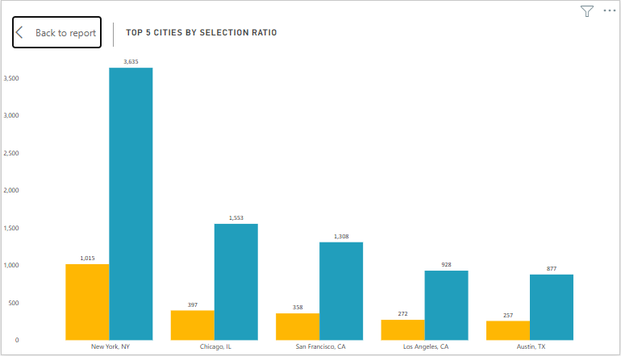

# Data Analyst Job Application Analysis

## Introduction:
This is a Power Bi project on Data Analyst Recruitment overview, using the United States 2019 Data Analyst Job dataset. The project is to analyze and derive insights to answer crucial questions that can aid HR hiring decisions.

_Disclaimer: All datasets and reports do not represent any company and/or institution. Consider this just a review of United State 2019 Data Analyst Job dataset to demonstrate capabilities of **Power Bi**_

## Problem Statement:
1. What is the Selection Ratio? 
1. What is the Hire-Rejection Ratio?
1. Which is the most hired job title and which city being in high demand?

## Skills/Concept demonstrated:
- Bookmarking
- DAX
- Modelling
- Filters
- Tooltips
- Button
- Shape
- Image

## Modelling:

The model is a **Flat schema**. There are just two tables that are related while others exist in isolation. The only dimension table is joined to the fact table with a **many-to- one relationship**.

## Visualization:
The report comprises of a single page, visualizing the Data Analyst job in United States in 2019. You can interact with the report [here](https://app.powerbi.com/view?r=eyJrIjoiYWQxNDU4MDAtYTQ5MC00YTI5LWExMWEtYzk2MDNhN2Q5ZjM1IiwidCI6IjM3NmQ3YjgwLTljNWEtNGMxNy05OWY1LTQ4MmJjYTY3MWQ4MCJ9&embedImagePlaceholder=true)

**Features:**
- Slicer (Tiles) to display and filter month.
- Slicer (Dropdown) to display and filter Job Title and Job Location
- The four buttons of “[Selection Ratio (SR), Hire-Rejection Ratio(H/R), Job Title and Cities]” to navigate corresponding visuals.

## Analysis:
### Application Headcount:

The total applications received in 2019 across all data analyst job titles amount to approximately **33K** while the total Hired applicants amount to **7,002** representing approximately **21%** of the total received applications.

### Monthly Headcount:

More than **2000** applications are submitted each month of the year **2019**. The month of **February have the lowest submitted applications (2,312)** while the month of **July have the highest number of applications (3,138)**.

### Selection Ratio:
Top 5 Application Cities          | Top 5 Cities By Selection Ratio
:--------------------------------:|:----------------------------------------:
 | 

Apparently, for every month in 2019, New York, NY have the highest number of applicants for data analyst job **(4,650)** and as well the most hired in term of headcount **(1,015)**. The displayed 5 cities top the table when compared against the overall received applications for the year but apparently, reverse is the case when compared to the level of rejection.

### Hire-Rejection Ratio:
Selection Ratio                 | Hire Rejection Ratio
:------------------------------:|:----------------------------:

